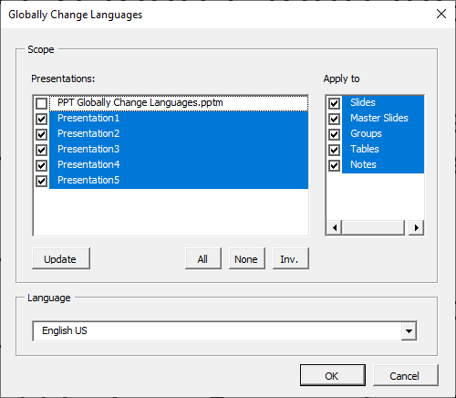

# MS Office Tools
This repo contains small auxiliary tools for the MS Office. I wrote them for
myself, but while searching for a solution, I saw that also others seem to have
the same problem and could profit.

## PPT Globally Change Languages
The MS PowerPoint language management for the spell check is lousy. Basically,
you would have to select every text field and change the language to change it.
This gets especially painful if you work in an international company, where
documents are edited in different lingual environments and may contain multiple
languages.

This tool allows to globally apply a language via VBA macro.

### Features:
- Chose 1 to many currently open presentations to be processed
- Process regular slides
- Process groups
- Process tables
- Process slide notes
- Process slide masters
- Process charts

### Release Notes:
- **2021-08-19 / Version 2 Beta**
   - New features: process masters ([Issue #1](https://github.com/MatthiasZbinden/MSOfficeTools/issues/1)),
     process charts ([Issue #2](https://github.com/MatthiasZbinden/MSOfficeTools/issues/2))
   - Buxfix for Mac OS implemented ([Issue #3](https://github.com/MatthiasZbinden/MSOfficeTools/issues/3))
   - Not yet thoroughly tested. There seem to be crashes depending on Chart Type,
     as some Chart Types do not have all Object Members I want to access, but I
     don't know how to check this in a proper way (without on Error GoTo)
- **2021-01-20 / Version 1**
   - Initial release
   - Stable

### Screenshot:

